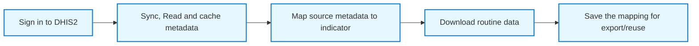

import { Callout } from 'nextra/components'
import { withGitHubAlert } from 'nextra/components'
import { HomeCards } from '@/components/HomeCards'
import { Steps } from 'nextra/components'

## CD2030 DHIS2 Data Extractor

The **CD2030 DHIS2 Data Extractor** helps teams connect to DHIS2, prepare metadata, map indicators, and download routine data in a way that is more stable and easier to reproduce than manual extraction.

It is designed to support large, multi-period downloads while reducing server strain, avoiding unnecessary repeat requests, and preserving progress through local caching.

<Callout type="info">
   **Access disclaimer:** The CD2030 DHIS2 Data Extractor does not allow unauthorized access to DHIS2 data.
</Callout>

## What the extractor does

The extractor supports a practical end-to-end workflow:

This process helps analysts produce a cleaner and more reproducible starting point for downstream analysis in DataSuite.

## Quick start steps

<Steps>
### [Login to DHIS2](/en/docs/apps/data-extractor/dhis2-login)
Connect to the correct DHIS2 instance using your server URL and valid account credentials.

### [Cache metadata](/en/docs/apps/data-extractor/dhis2-login#read-and-cache-metadata)
Temporarily cache(store)  metadata locally for fast access and efficient downloading

### [Choose a mapping mode](/en/docs/apps/data-extractor/mapping#map-metadata)
Use Countdown mapping for the harmonized MNCH template or Custom mapping for other programs.

### [Download data](/en/docs/apps/data-extractor/data-download)
Run extraction with smaller requests and reuse cached metadata to minimize repeat downloads.
</Steps>

